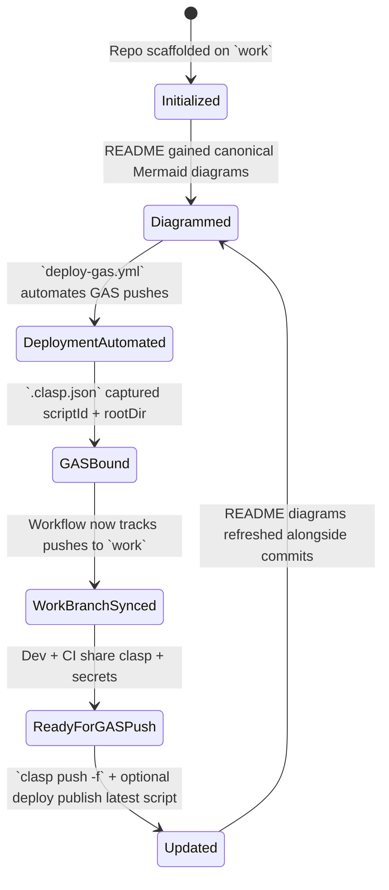
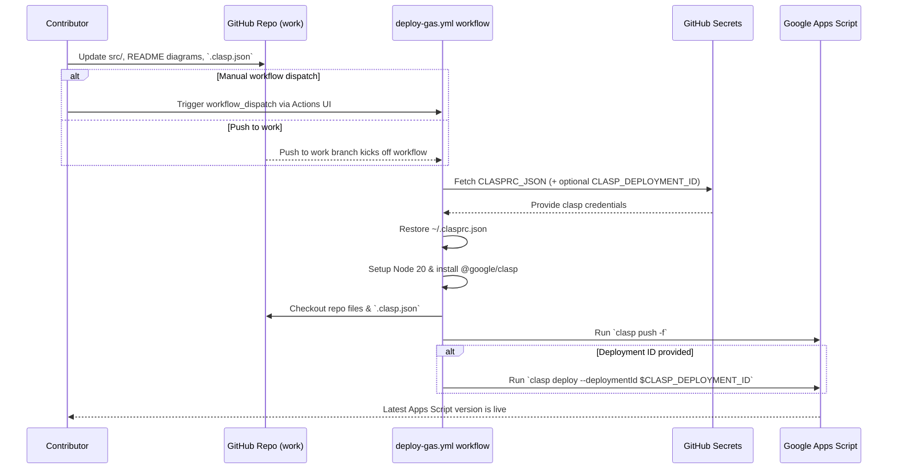

# Repository Visual Overview

## Git History
```mermaid
gitGraph
    commit id: "Initial commit" tag: "76f4655"
    branch codex/insert-and-update-mermaid-diagrams-in-readme
    checkout codex/insert-and-update-mermaid-diagrams-in-readme
    commit id: "Add README diagrams" tag: "e9d2b72"
    checkout work
    merge codex/insert-and-update-mermaid-diagrams-in-readme tag: "9762afb"
    branch codex/create-github-actions-workflow-for-gas-deployment
    checkout codex/create-github-actions-workflow-for-gas-deployment
    commit id: "Automate GAS deploys" tag: "ad22ec6"
    checkout work
    merge codex/create-github-actions-workflow-for-gas-deployment tag: "edc5690"
    branch codex/create-.clasp.json-file-with-scriptid-and-rootdir
    checkout codex/create-.clasp.json-file-with-scriptid-and-rootdir
    commit id: "Add clasp config" tag: "c7d1438"
    checkout work
    merge codex/create-.clasp.json-file-with-scriptid-and-rootdir tag: "f6d7e5e"
    branch codex/update-deploy-gas.yml-to-include-work-branch
    checkout codex/update-deploy-gas.yml-to-include-work-branch
    commit id: "Align deploy workflow with work branch" tag: "8254914"
    checkout work
    merge codex/update-deploy-gas.yml-to-include-work-branch tag: "99ff679 (HEAD)"
```

## Repository State Progression


## Contribution Sequence


## Current Architecture Overview
```mermaid
flowchart TD
    subgraph Repo
        README[README.md diagrams]
        Workflow[.github/workflows/deploy-gas.yml]
        ClaspConfig[.clasp.json binding]
        Source[src/ Apps Script sources]
    end
    Secrets[GitHub Secrets\nCLASPRC_JSON + CLASP_DEPLOYMENT_ID]
    ActionsUI[GitHub Actions UI\n(workflow_dispatch)]
    Runner[GitHub Actions Runner + @google/clasp]
    GAS[Google Apps Script Project]
    Contributors[Contributors & Reviewers]
    Contributors --> README
    Contributors --> Source
    Contributors --> Workflow
    Contributors --> ActionsUI
    README --> Contributors
    Workflow --> Runner
    ClaspConfig --> Runner
    Source --> ClaspConfig
    Source --> Runner
    Secrets --> Runner
    ActionsUI --> Runner
    Runner --> GAS
    GAS --> Contributors
```

## Swimlane Responsibilities
```mermaid
flowchart LR
    subgraph User
        U1[Plan updates + branch strategy]
        U2[Edit src/, README diagrams, `.clasp.json`]
        U3[Push to `work` or dispatch workflow manually]
        U4[Monitor Google Apps Script results]
    end
    subgraph Frontend
        F1[Render README Mermaid diagrams for visibility]
    end
    subgraph Backend
        B1[GitHub Actions listens to `work` + workflow_dispatch]
        B2[Restore ~/.clasprc.json from CLASPRC_JSON secret]
        B3[@google/clasp pushes/deploys GAS project]
        B4[Google Apps Script hosts latest version]
    end
    U1 --> U2 --> U3 --> B1 --> B2 --> B3 --> B4 --> U4
    U2 --> F1
```

## Maintenance Notes
- Always keep the diagrams above synchronized with the actual repository structure, git history, and workflows whenever changes are made.
- Update this README alongside any code or documentation changes to ensure future contributors can rely on the visual overview.
- Verify `.github/workflows/deploy-gas.yml` continues to restore `~/.clasprc.json`, install `@google/clasp`, and run `clasp push -f` (plus optional `clasp deploy`) whenever the deployment process evolves.
- Keep `.clasp.json` synchronized with the Apps Script project (`AKfycbxzV1ZsEhazhBugZuDUFcPRl1BDpRP70dNDO7xHe7pUm1c1XQ`) and the chosen `rootDir` (`src`).
