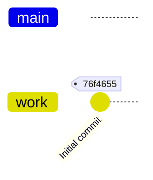
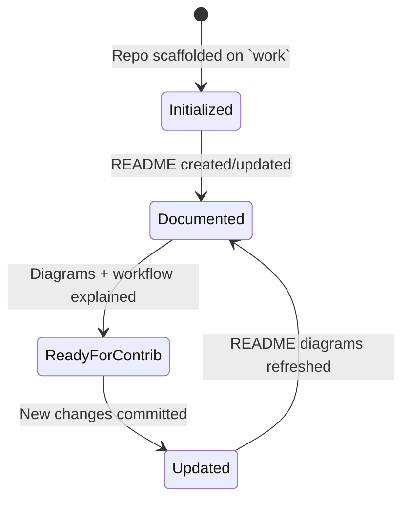
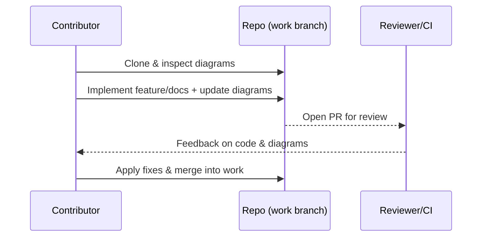
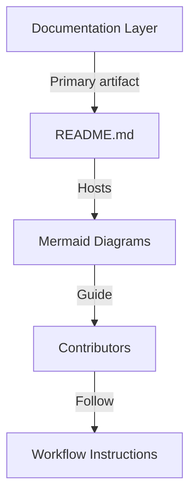
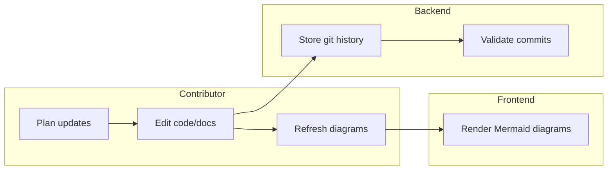

# Repository Visual Overview

## Git History

## Repository State Progression

## Contribution Sequence

## Current Architecture Overview

## Swimlane Responsibilities

## Maintenance Notes
- Always keep the diagrams above synchronized with the actual repository structure, git history, and workflows whenever changes are made.
- Update this README alongside any code or documentation changes to ensure future contributors can rely on the visual overview.

# test-clasp
