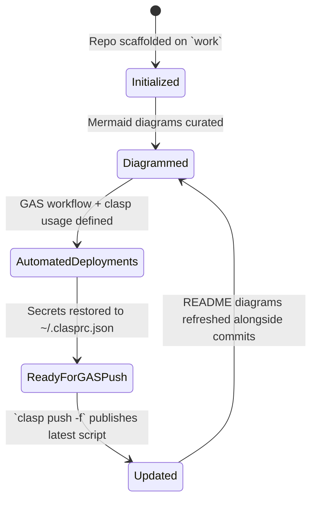
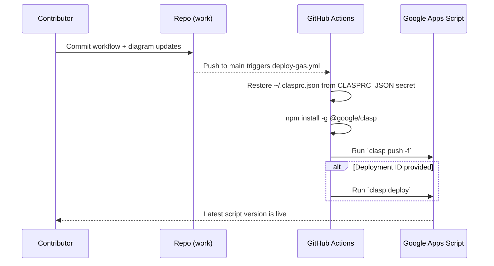
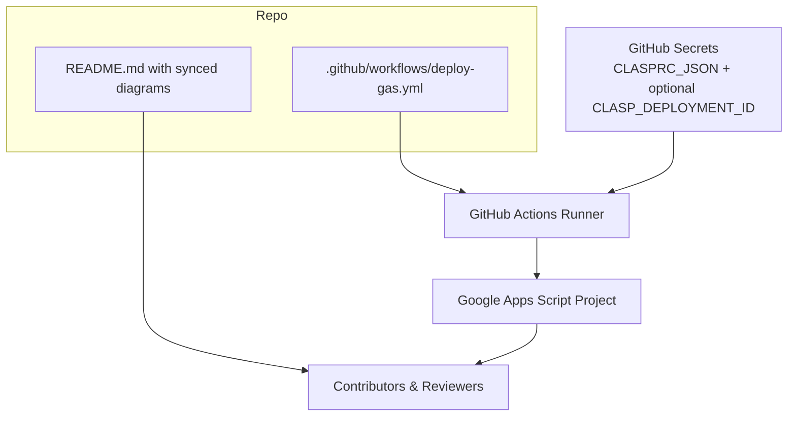

# Repository Visual Overview

## Git History
```mermaid
gitGraph
    commit id: "Initial commit" tag: "76f4655"
    branch codex/insert-and-update-mermaid-diagrams-in-readme
    checkout codex/insert-and-update-mermaid-diagrams-in-readme
    commit id: "Add README diagrams" tag: "e9d2b72"
    checkout work
    merge codex/insert-and-update-mermaid-diagrams-in-readme tag: "9762afb"
    commit id: "Automate GAS deploys" tag: "HEAD"
```

## Repository State Progression


## Contribution Sequence


## Current Architecture Overview


## Swimlane Responsibilities
```mermaid
flowchart LR
    subgraph User
        U1[Plan updates and track git branches]
        U2[Commit README + workflow changes]
        U3[Push to main to trigger deploy]
    end
    subgraph Frontend
        F1[Render Mermaid diagrams for visibility]
    end
    subgraph Backend
        B1[GitHub Actions executes deploy-gas.yml]
        B2[@google/clasp pushes and deploys GAS project]
    end
    U1 --> U2 --> U3 --> B1 --> B2
    U2 --> F1
    B2 --> U1
```

## Maintenance Notes
- Always keep the diagrams above synchronized with the actual repository structure, git history, and workflows whenever changes are made.
- Update this README alongside any code or documentation changes to ensure future contributors can rely on the visual overview.
- Verify `.github/workflows/deploy-gas.yml` continues to restore `~/.clasprc.json`, install `@google/clasp`, and run `clasp push -f` (plus optional `clasp deploy`) whenever the deployment process evolves.
