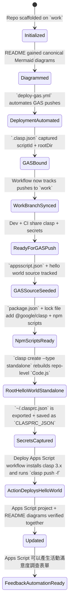
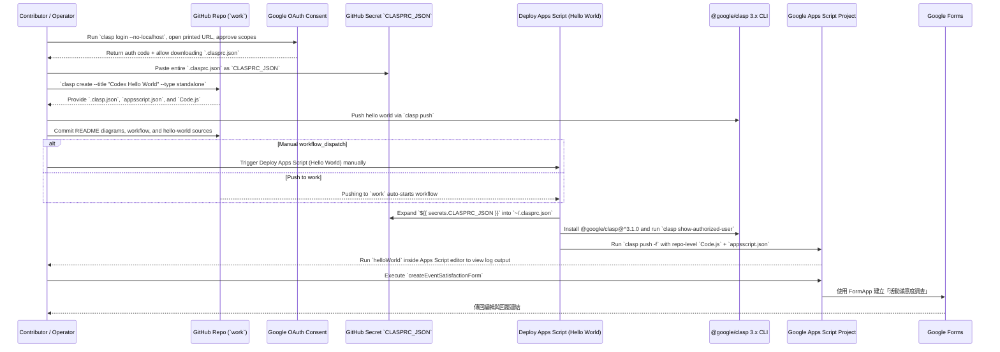

# Repository Visual Overview

## Git History
```mermaid
gitGraph
    commit id: "Initial commit" tag: "76f4655"
    branch codex/insert-and-update-mermaid-diagrams-in-readme
    checkout codex/insert-and-update-mermaid-diagrams-in-readme
    commit id: "Add required Mermaid diagrams to README" tag: "e9d2b72"
    checkout work
    merge codex/insert-and-update-mermaid-diagrams-in-readme tag: "9762afb"
    branch codex/create-github-actions-workflow-for-gas-deployment
    checkout codex/create-github-actions-workflow-for-gas-deployment
    commit id: "Automate GAS deploys via GitHub Actions" tag: "ad22ec6"
    checkout work
    merge codex/create-github-actions-workflow-for-gas-deployment tag: "edc5690"
    branch codex/create-.clasp.json-file-with-scriptid-and-rootdir
    checkout codex/create-.clasp.json-file-with-scriptid-and-rootdir
    commit id: "Add clasp config" tag: "c7d1438"
    checkout work
    merge codex/create-.clasp.json-file-with-scriptid-and-rootdir tag: "f6d7e5e"
    branch codex/update-deploy-gas.yml-to-include-work-branch
    checkout codex/update-deploy-gas.yml-to-include-work-branch
    commit id: "Align deploy workflow with work branch" tag: "8254914"
    checkout work
    merge codex/update-deploy-gas.yml-to-include-work-branch tag: "99ff679"
    branch codex/update-diagrams-in-readme.md
    checkout codex/update-diagrams-in-readme.md
    commit id: "Update README diagrams" tag: "17e34b5"
    checkout work
    merge codex/update-diagrams-in-readme.md tag: "3a0f63b"
    branch codex/add-appsscript.json-and-source-files
    checkout codex/add-appsscript.json-and-source-files
    commit id: "Add Apps Script manifest and sample code" tag: "6c38270"
    checkout work
    merge codex/add-appsscript.json-and-source-files tag: "8960298"
    branch codex/setup-google-apps-script-project
    checkout codex/setup-google-apps-script-project
    commit id: "Sync src with clasp hello world" tag: "53e2a81"
    checkout work
    merge codex/setup-google-apps-script-project tag: "becf78b"
    branch codex/initialize-npm-and-add-clasp-dependency
    checkout codex/initialize-npm-and-add-clasp-dependency
    commit id: "feat: add npm-based clasp helper" tag: "170721e"
    checkout work
    merge codex/initialize-npm-and-add-clasp-dependency tag: "c0b633d"
    commit id: "Rebuild root-level clasp hello world" tag: "6b39c3e"
    branch codex/create-event-satisfaction-form
    checkout codex/create-event-satisfaction-form
    commit id: "Add event satisfaction form builder" tag: "a1b2c3d"
    checkout work
    merge codex/create-event-satisfaction-form tag: "HEAD"
```

## Repository State Progression


## Contribution Sequence


## Current Architecture Overview
```mermaid
flowchart TD
    subgraph Repo
        README[README.md diagrams]
        Workflow[.github/workflows/deploy-gas.yml\nDeploy Apps Script (Hello World)]
        ClaspConfig[.clasp.json\nscriptId=1iIM3e...]
        Manifest[appsscript.json]
        Code[Code.js helloWorld + createEventSatisfactionForm]
        Package[package.json + package-lock.json\n`npm run deploy`]
    end
    FormBuilder[FormApp API\nGoogle Forms runtime]
    Secrets[GitHub Secret\nCLASPRC_JSON]
    OAuth[clasp login --no-localhost\nGoogle OAuth]
    ActionsUI[GitHub Actions UI]
    Runner[GitHub Actions Runner + Node 20]
    ClaspCLI[@google/clasp 3.x]
    GAS[Google Apps Script\n"Codex Hello World"]
    Contributors[Contributors & Reviewers]
    Contributors --> OAuth
    OAuth --> Contributors
    Contributors --> README
    Contributors --> Workflow
    Contributors --> ClaspConfig
    Contributors --> Manifest
    Contributors --> Code
    Contributors --> Package
    Contributors --> ActionsUI
    README --> Contributors
    Workflow --> Runner
    ClaspConfig --> Runner
    Manifest --> ClaspCLI
    Code --> ClaspCLI
    Code --> FormBuilder
    ClaspCLI --> Runner
    Runner --> GAS
    Secrets --> Runner
    ActionsUI --> Runner
    Runner --> ClaspCLI
    Package --> Runner
    Package --> ClaspCLI
    GAS --> Contributors
    FormBuilder --> GAS
    FormBuilder --> Contributors
```

## Swimlane Responsibilities
```mermaid
flowchart LR
    subgraph User
        U1[Enable Apps Script API + install @google/clasp@^3.1.0]
        U2[Run `clasp login --no-localhost`, share URL + paste auth code]
        U3[Copy `~/.clasprc.json` into GitHub secret `CLASPRC_JSON`]
        U4[Run `clasp create` + edit `Code.js`, `appsscript.json`, README diagrams]
        U5[Commit + push to `work` or dispatch workflow]
        U6[Test Deploy Apps Script workflow + run `helloWorld` in Apps Script]
    end
    subgraph Frontend
        F1[README Mermaid diagrams reflect git/state/sequence/architecture/swimlane]
        F2[Actions UI shows Deploy Apps Script (Hello World) status]
        F3[Google Form UI 提供活動滿意度填寫]
    end
    subgraph Backend
        B1[Workflow installs Node 20 + @google/clasp@^3.1.0]
        B2[Workflow writes `${{ secrets.CLASPRC_JSON }}` to `~/.clasprc.json`]
        B3[`clasp show-authorized-user` confirms login]
        B4[`clasp push -f` deploys `Code.js` + `appsscript.json`]
        B5[Apps Script runtime logs "Hello from Codex + GitHub Actions!"]
        B6[`createEventSatisfactionForm` 透過 FormApp 建立表單]
    end
    U1 --> U2 --> U3 --> U4 --> U5 --> B1 --> B2 --> B3 --> B4 --> B5 --> B6 --> U6
    U4 --> F1
    U5 --> F2
    B6 --> F3
    U6 --> F3
```

## Maintenance Notes
- Always keep the diagrams above synchronized with the actual repository structure, git history, workflows, and secrets requirements whenever changes are made.
- Update this README alongside any code or documentation changes to ensure future contributors can rely on the visual overview.
- Verify `.github/workflows/deploy-gas.yml` continues to restore `~/.clasprc.json`, install `@google/clasp@^3.1.0`, and run `clasp push -f` whenever the deployment process evolves.
- Keep `.clasp.json` synchronized with the Apps Script project (`1iIM3e365Bwlswebl25oP3dgVZXpIcX25LsFh3R5vyc4DOYgXjwliK0Dg`) and the current `rootDir` (repo root).
