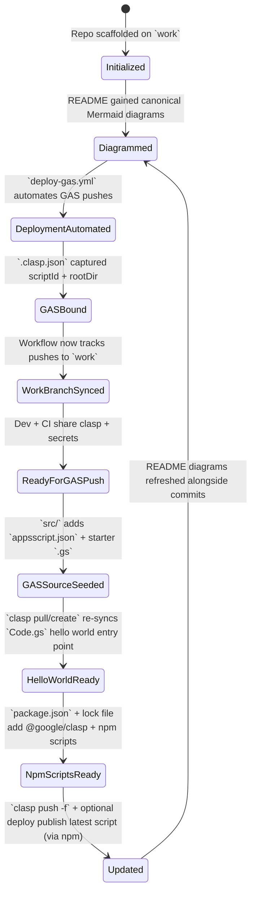
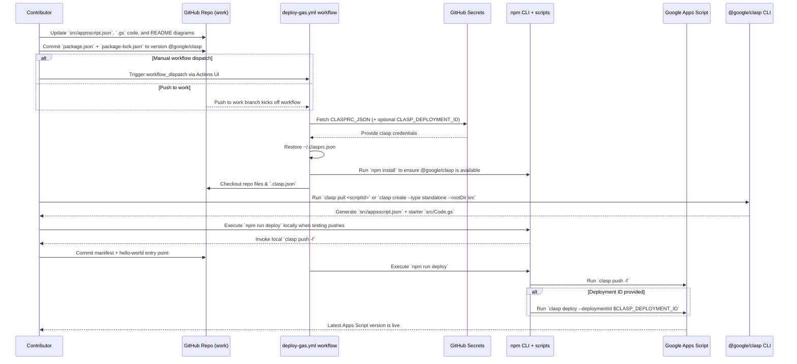

# Repository Visual Overview

## Git History
```mermaid
gitGraph
    commit id: "Initial commit" tag: "76f4655"
    branch codex/insert-and-update-mermaid-diagrams-in-readme
    checkout codex/insert-and-update-mermaid-diagrams-in-readme
    commit id: "Add README diagrams" tag: "e9d2b72"
    checkout work
    merge codex/insert-and-update-mermaid-diagrams-in-readme tag: "9762afb"
    branch codex/create-github-actions-workflow-for-gas-deployment
    checkout codex/create-github-actions-workflow-for-gas-deployment
    commit id: "Automate GAS deploys" tag: "ad22ec6"
    checkout work
    merge codex/create-github-actions-workflow-for-gas-deployment tag: "edc5690"
    branch codex/create-.clasp.json-file-with-scriptid-and-rootdir
    checkout codex/create-.clasp.json-file-with-scriptid-and-rootdir
    commit id: "Add clasp config" tag: "c7d1438"
    checkout work
    merge codex/create-.clasp.json-file-with-scriptid-and-rootdir tag: "f6d7e5e"
    branch codex/update-deploy-gas.yml-to-include-work-branch
    checkout codex/update-deploy-gas.yml-to-include-work-branch
    commit id: "Align deploy workflow with work branch" tag: "8254914"
    checkout work
    merge codex/update-deploy-gas.yml-to-include-work-branch tag: "99ff679"
    branch codex/add-appsscript.json-and-source-files
    checkout codex/add-appsscript.json-and-source-files
    commit id: "Add Apps Script manifest and sample code" tag: "6c38270"
    checkout work
    merge codex/add-appsscript.json-and-source-files tag: "8960298"
    branch codex/setup-google-apps-script-project
    checkout codex/setup-google-apps-script-project
    commit id: "Sync src with clasp hello world" tag: "53e2a81"
    checkout work
    merge codex/setup-google-apps-script-project tag: "becf78b"
    commit id: "Add npm-based clasp helper" tag: "HEAD"
```

## Repository State Progression


## Contribution Sequence


## Current Architecture Overview
```mermaid
flowchart TD
    subgraph Repo
        README[README.md diagrams]
        Workflow[.github/workflows/deploy-gas.yml]
        ClaspConfig[.clasp.json binding]
        Source[src/ Apps Script sources]
        Code[Code.gs hello world]
        Manifest[appsscript.json manifest]
        Package[package.json + package-lock.json]
    end
    Secrets[GitHub Secrets\nCLASPRC_JSON + CLASP_DEPLOYMENT_ID]
    ClaspCLI[@google/clasp CLI\n(pull/create)]
    ActionsUI[GitHub Actions UI\n(workflow_dispatch)]
    Runner[GitHub Actions Runner + @google/clasp]
    NpmCLI[npm CLI + scripts\n(node_modules/.bin)]
    GAS[Google Apps Script Project]
    Contributors[Contributors & Reviewers]
    Contributors --> README
    Contributors --> Source
    Contributors --> Workflow
    Contributors --> Package
    Contributors --> ActionsUI
    Contributors --> NpmCLI
    README --> Contributors
    Workflow --> Runner
    ClaspConfig --> Runner
    Source --> ClaspConfig
    Source --> Manifest
    Source --> Code
    Code --> ClaspCLI
    Manifest --> ClaspCLI
    ClaspCLI --> Contributors
    ClaspCLI --> Runner
    Package --> NpmCLI
    NpmCLI --> ClaspCLI
    Manifest --> Runner
    Source --> Runner
    Package --> Runner
    Secrets --> Runner
    ActionsUI --> Runner
    Runner --> NpmCLI
    Runner --> GAS
    GAS --> Contributors
```

## Swimlane Responsibilities
```mermaid
flowchart LR
    subgraph User
        U1[Plan updates + branch strategy]
        U2[Run `clasp pull/create` to sync manifest + hello world]
        U3[Edit `src/`, manifest, README diagrams, `.clasp.json`, npm metadata]
        U4[Run `npm install` + `npm run deploy` locally]
        U5[Push to `work` or dispatch workflow manually]
        U6[Monitor Google Apps Script results]
    end
    subgraph Frontend
        F1[Render README Mermaid diagrams for visibility]
    end
    subgraph Backend
        B1[GitHub Actions listens to `work` + workflow_dispatch]
        B2[Restore ~/.clasprc.json from CLASPRC_JSON secret]
        B3[@google/clasp pull/create seeds manifest + `Code.gs`]
        B4[npm install restores @google/clasp CLI + scripts]
        B5[`npm run deploy` pushes/deploys GAS project]
        B6[Google Apps Script hosts latest version]
    end
    U1 --> U2 --> U3 --> U4 --> U5 --> B1 --> B2 --> B3 --> B4 --> B5 --> B6 --> U6
    U3 --> F1
```

## Maintenance Notes
- Always keep the diagrams above synchronized with the actual repository structure, git history, and workflows whenever changes are made.
- Update this README alongside any code or documentation changes to ensure future contributors can rely on the visual overview.
- Verify `.github/workflows/deploy-gas.yml` continues to restore `~/.clasprc.json`, install `@google/clasp`, and run `clasp push -f` (plus optional `clasp deploy`) whenever the deployment process evolves.
- Keep `.clasp.json` synchronized with the Apps Script project (`AKfycbxzV1ZsEhazhBugZuDUFcPRl1BDpRP70dNDO7xHe7pUm1c1XQ`) and the chosen `rootDir` (`src`).
